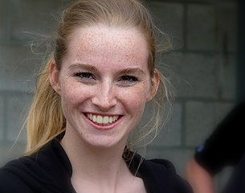
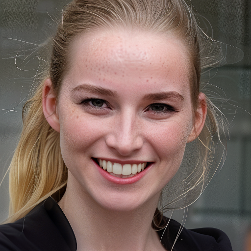
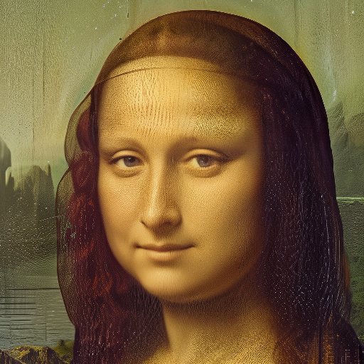

# Face isolate
Produces 512 pixel square images focused on faces, potentially automatically upscaling to fit. 

Intended as a fire and forget preprocessing tool for training subject consistent face models or Low-Rank Adaptions on photographs containing faces. Aims for consistency and repeatability.

## Examples
| Source | Isolate  |
|-----------|--------|
|||
|||

## Workflow summary

### Load to crop
From a loaded image a segment anything prompt is used to obtain a face mask. 

This mask is converted to a rectangular region, adding both fixed pixel padding and image size proportional padding. 

This region then cuts the loaded image to the isolate source, which is saved.

### Overscaling
Using the minimum image dimension of the isolated source, the required upscale factor to obtain at least 1024 pixel square is calculated.

The isolate image is upscaled by this factor using an Ultimate SD Upscale node. Stable Diffusion configuration is discussed below.

### Crop to square
The 1024 pixel square centre of the scaled image is cropped out by symmetric removal of the bands of the longer edge.

This double size square is then downsampled to 512 pixel square and saved as the isolated image.

## Stable Diffusion
Beyond the mechanics above, the meaningful utility of this workflow is automated upscaling, potentially several fold. With the target use case being to retain facial features, the Stable Diffusion configuration is difficult. A balance is sought between quality and extraction.

Heavy modelling (for example opinionated checkpoints, high denoising, high configuration strength, linear scheduling) is liable to destroy the characteristics of the source face.

Light modelling (for example model omission, extremely low denoising) is liable to persist scaling errors such as deformities, or scaling artifacts such as blur or pixelation.

### Model
Targeting use on photographs, I've used CyberRealistic, modified with FreeU_V2, and Self-Attention Guidance. Little research or tuning was undertaken at this high level.

### Sampler
Following some experimentation I've arrived at the following sampler configuration.

| parameter | value  |
|-----------|--------|
| sampler   | lcm    |
| scheduler | karras |
| cfg       | 1.0    |
| steps     | 8      |
| denoise   | 0.25   |

I've taken LCM over e.g. dpmpp_2m_sde as LCM tends to introduce less structural changes. In combination Karras or Exponential scheduling help mitigate LCMs tendency to apply checkpoint face structure over the structure inherent to the image. Unfortunately for this sacrifice I find LCM typically over smooth, being unlikely to retain texture such as freckles or blush.

Denoising is a balancing act, with this configuration being sensitive across the 0.10 - 0.3 range. Low denoising persists nonsensical scaling artifacts, whilst high denoising asserts model facial geometry, destroying the subject information.

Given this low denoising, steps and cfg are insensitive. Though lower cfg risks destroying the subject.

### Prompts, Image Prompt Adapter
Given the low denoising required to protect the subject, prompting utility is limited. For example extreme prompt strength is unlikely to be able to be diffused onto large features. Thus I combine two types of prompt, protective Text Encoding designed to ward off artifacts and colour space conversion, and a heavily weighted Face ID V2 IPAdapter to attempt to preserve the subject.

The positive text prompts aim to avoid blur or desaturation. The negative text prompts specify extreme lighting features, artistic or render aesthetics, artifacts such as grain, and additions like watermarks.

## Image licensing

The two examples in this repository are generated from the following two images.

[Mona Lisa, by Leonardo da Vinci, from C2RMF retouched](https://commons.wikimedia.org/wiki/File:Mona_Lisa,_by_Leonardo_da_Vinci,_from_C2RMF_retouched.jpg), public domain.

[Smiling model with freckles](https://commons.wikimedia.org/wiki/File:Smiling_model_with_freckles.jpg), Creative Commons, Eddy Van 3000.